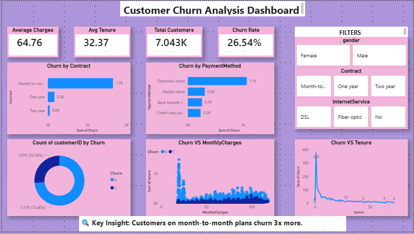

# Customer Retention & Churn Analysis

## 📌 Overview

This project analyzes customer churn behavior in a subscription-based business. The goal is to identify key factors driving churn and provide actionable insights to improve customer retention.

## 📊 Dataset

Telco Customer Churn dataset containing customer demographics, subscription details, and churn status.

## 🛠 Tools Used

* Python (Pandas, Matplotlib, Seaborn)
* Power BI
* Excel

## 🔍 Key Insights

* Month-to-month contract customers churn the most
* High churn observed in first 12 months
* Higher monthly charges increase churn probability
* Tech support and long-term plans improve retention

## 💡 Business Recommendations

* Promote annual subscription plans
* Improve onboarding experience
* Introduce loyalty rewards
* Target high-risk customers

## 📊 Dashboard

## 🚀 Conclusion

Reducing churn requires a combination of pricing strategy, customer engagement, and service improvements.
